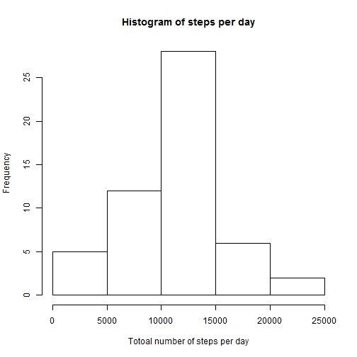
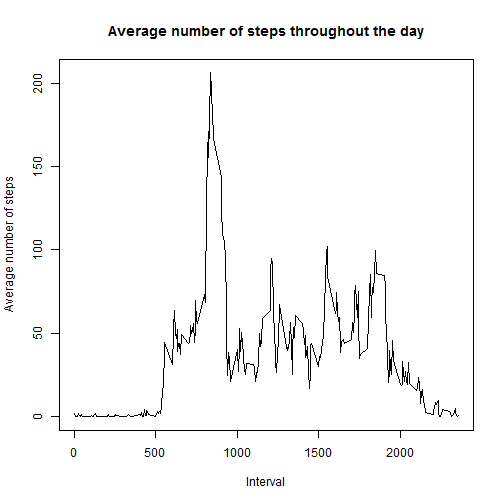
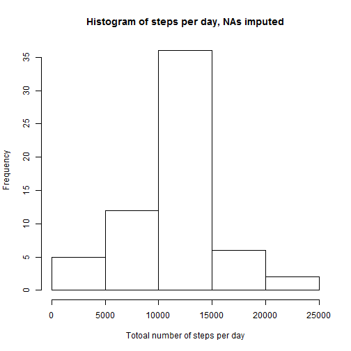
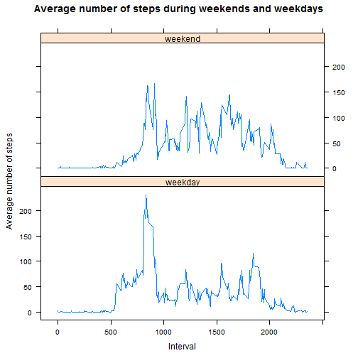

## Loading and preprocessing the data
This part is simple:  
- Unzip the data file

```r
unzip("activity.zip")
```
- Read the data into a dataframe called "steps", keeping the default options for NA's, etc.

```r
steps<-read.csv("activity.csv")
```
- Change the "date" variable into a date format

```r
steps<-transform(steps, date=as.Date(date, format="%Y-%m-%d"))
```
To check if everything is all right, we may look at the first 5 rows:

```r
head(steps)
```

```
##   steps       date interval
## 1    NA 2012-10-01        0
## 2    NA 2012-10-01        5
## 3    NA 2012-10-01       10
## 4    NA 2012-10-01       15
## 5    NA 2012-10-01       20
## 6    NA 2012-10-01       25
```
## What is mean total number of steps taken per day?
First, let's compute the total number of steps for each day:

```r
tot_steps1<-aggregate(steps$steps, by=list(date=steps$date), FUN="sum")
```
Now, we can produce the histogram:

```r
hist(tot_steps1$x, xlab="Totoal number of steps per day", main="Histogram of steps per day")
```

 
  
And the mean and median are:

```r
mean(tot_steps1$x, na.rm=TRUE)
```

```
## [1] 10766
```

```r
median(tot_steps1$x, na.rm=TRUE)
```

```
## [1] 10765
```
## What is the average daily activity pattern?
Similarily to the previous step we can compute the mean number of steps for each interval:

```r
av_steps1<-aggregate(steps$steps, by=list(Interval=steps$interval), FUN="mean", na.rm=TRUE)
```
Throughout the average day, the activity measured in steps looks like this:

```r
plot(av_steps1$Interval, av_steps1$x, type="l", main="Average number of steps throughout the day", xlab="Interval", ylab="Average number of steps")
```

 
  
The maximum average number of steps is:

```r
max(av_steps1$x)
```

```
## [1] 206.2
```
and happens to be in the interval:

```r
av_steps1$Interval[grep(max(av_steps1$x), av_steps1$x, fixed=TRUE)]
```

```
## [1] 835
```

## Imputing missing values
To calculate the number of missing values we can:
- First, create a logical vector indicating which rows have NAs

```r
missing<-is.na(steps$steps)
```
- Then, summarise it in a table and see the count for TRUE

```r
table(missing)
```

```
## missing
## FALSE  TRUE 
## 15264  2304
```
To fill in the missing values, we can use the averages computed before, that give the mean number of steps for each 5min interval throughout the day.  
To impute the average number of steps in the intervals that have NAs, we first create a new data frame with only the rows with missing values:

```r
ind<-steps[missing,]
```
Then, we merge this subset with the data frame on average steps in each interval, so that the intervals are matching:

```r
g<-merge(ind, av_steps1, by.x="interval", by.y="Interval")
```
This gives us a data frame with as many rows (observations) as were missing values:

```r
length(g[,1])
```

```
## [1] 2304
```
...and 4 variables: *steps*, *date*, *interval* and an additional variable *x* - the average steps for the matching interval, taken from the averages data frame.

```r
head(g)
```

```
##   interval steps       date     x
## 1        0    NA 2012-10-01 1.717
## 2        0    NA 2012-11-30 1.717
## 3        0    NA 2012-11-04 1.717
## 4        0    NA 2012-11-09 1.717
## 5        0    NA 2012-11-14 1.717
## 6        0    NA 2012-11-10 1.717
```
Next, we can create a data frame similar to the original one, but with missing values imputed (taken from the data frame in previous step):
- First, for the rows with NAs

```r
naData<-data.frame(steps=g$x, date=g$date, interval=g$interval)
```
- Then, for all other rows (nothing added, just copied from original data)

```r
goodData<-steps[!missing,]
```
- And finally join the two and sort on date and interval

```r
impuSteps<-rbind(naData, goodData)
impuSteps<-impuSteps[order(impuSteps$date, impuSteps$interval),]
```
Now we can construct a histogram, similarily to the first question. First we compute the aggregates for each day:

```r
tot_steps2<-aggregate(impuSteps$steps, by=list(date=impuSteps$date), FUN="sum")
```
Then, we create a plot:

```r
hist(tot_steps2$x, xlab="Totoal number of steps per day", main="Histogram of steps per day, NAs imputed")
```

 
  
The mean and median are:

```r
mean(tot_steps2$x)
```

```
## [1] 10766
```

```r
median(tot_steps2$x)
```

```
## [1] 10766
```
The mean and median have not changed - that is what you would like when you impute missing values: a good strategy for filling in should not change the distribution.  

## Are there differences in activity patterns between weekdays and weekends?
To create a factor variable indicating whether a particular date was on weekend or not, we first create a character vector. The function ifelse checks a logical condition in the *date* variable of our data frame (using the local names of days of the week) and puts *weekday* or *weekend* into a character vector accordingly.

```r
dayOfweek<-ifelse(weekdays(impuSteps$date) %in% c("sobota", "niedziela"), "weekend", "weekday")
```
Now we can add a factor variable to the data frame.

```r
impuSteps$dOw<-factor(dayOfweek, levels=c("weekday", "weekend"))
```
To construct a comparison beetween weekdays and weekends we will use the lattice plotting system.

```r
library(lattice)
```
First, we need the averages for each time interval, similar to question 2, but slit into *weekday* and *weekend* group :

```r
av_steps2<-aggregate(impuSteps$steps, by=list(Interval=impuSteps$interval, dOw=impuSteps$dOw), FUN="mean")
```
Now we can construct the plot:

```r
xyplot(x~Interval|dOw, data=av_steps2, layout=c(1,2), type="l", ylab="Average number of steps", main="Average number of steps during weekends and weekdays")
```

 
